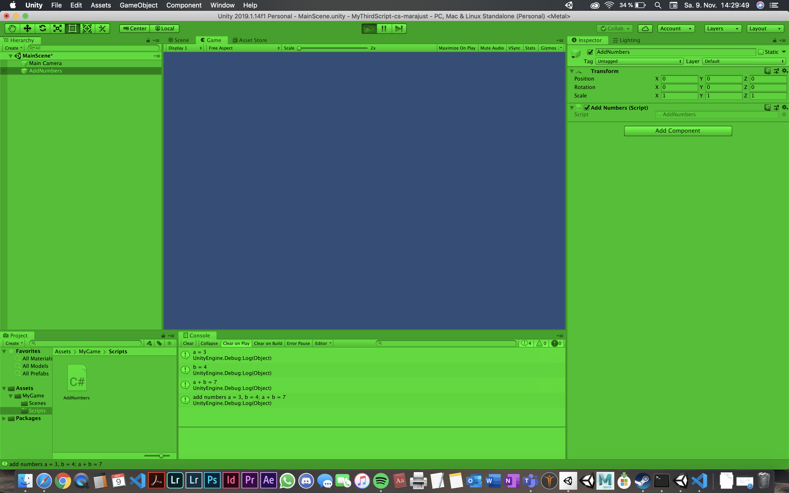

# MyThirdScript-cs-marajust

### Project Description: 

Working with the console with variables and strings; work with gitHub, README and git to improve my skills

### Development platform: 

MacOS Mojave (10.14.6), Unity 2019.1.14f1, Visual Studio Code 1.38.1

### Target platform: 

WebGL (RefRes: 1280x720 HD-720p)  

### Screenshots:

    
### Lessons Learned:

How to add Numbers in the Console and write a useful README.
    